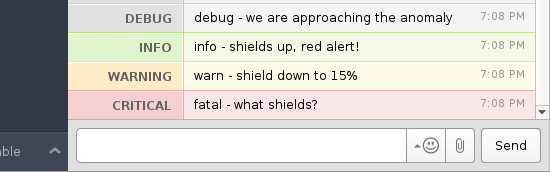

Hiplogging
==========

With Hiplogging, you can keep using the standard python [logging](https://docs.python.org/2/library/logging.html) module, *and* have the important log messages in HipChat, where they might actually reach you :)

Collaborator wanted!
--------
Hi there, internet stranger! As time is a scarce resource for me nowadays, I'm looking for a collaborator to handle issues and pull requests in a more timely manner. If you are interested, send me an email at `invernizzi.l@gmail.com`. 


Installation
--------

Execute:

```bash
sudo python setup.py install
```

or, from pip
```bash
sudo pip install hiplogging
```


Example
--------

Here’s how you use this. In bash:
```bash
export HIPCHAT_ACCESS_TOKEN='ABCDEF'
export HIPCHAT_ROOM='HelloWorld'
```

You can an access token from [this link](https://<YOUR_HIPCHAT_NAME>.hipchat.com/admin/api).

Then, in the sweet code:

```python
import os
import logging
import hiplogging

# Set up a standard logger
logger = logging.getLogger('hipchat')
logger.setLevel(logging.DEBUG)
# Add the standard logging to stderr
logger.addHandler(logging.StreamHandler())

# Add the hipchat handler
# Get an access token from: https://<YOUR_HIPCHAT_NAME>.hipchat.com/admin/api
handler = hiplogging.HipChatHandler(os.environ['HIPCHAT_ACCESS_TOKEN'],
                                    os.environ['HIPCHAT_ROOM'])
# Additionally, you can add an optional third argument `environment`, if your
# host your HipChat server.
# i.e.: https//hipchat.yourdomain.com
handler.setLevel(logging.DEBUG)
logger.addHandler(handler)

# Try it out: messages will be visible both in the console and on hipchat.
logger.debug('debug - we are approaching the anomaly')
logger.info('info - shields up, red alert!')
logger.warn('warn - shield down to 15%')
logger.fatal('fatal - what shields?')
```

## This is what you get


 You can set your own colors and the sender name using extra with logging.log.
```python
# Valid colors are ["purple", "gray", "green", "yellow", "red"]
# The first argument is the log level:
#    https://docs.python.org/2/library/logging.html#logging-levels
#    https://docs.python.org/2/library/logging.html#logging.log
logger.log(20, "Another message", extra={'color':'purple', "sender":"FOOBAR"})
```
